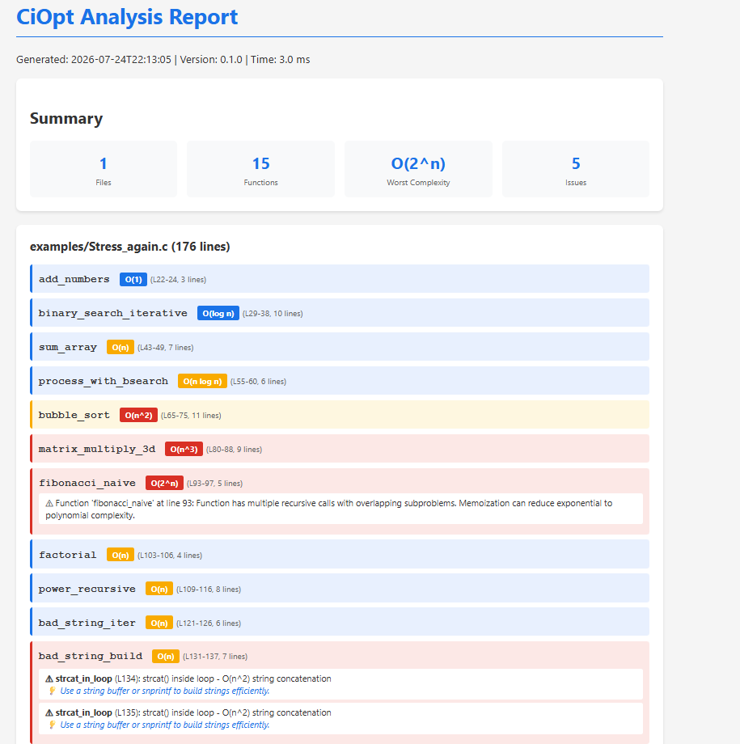
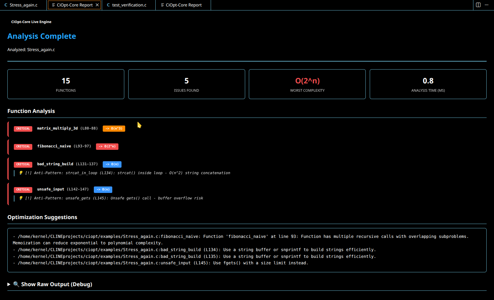

<p align="center">
  
  <a href="https://marketplace.visualstudio.com/items?itemName=asifahamed-ece.ciopt-core" target="_blank">
    
  </a>
  
  
  
  
  
</p>

<p align="center">
  
</p>

# CiOpt — AI-Powered C Code Complexity & Optimization Engine

> *"Analyze. Detect. Accelerate."*

**Developed by [Asif Ahamed](https://github.com/asifahamed-ece)**

CiOpt is a **compiler-inspired static analysis tool** for C that automatically estimates Big-O complexity, detects performance bottlenecks, finds anti-patterns, and suggests optimizations — **all without compiling or running your code**.

```
Source Code → Tree-sitter CST → AST Wrapper → Analysis → Report
```

---

## Built for Vibe Coders

CiOpt is **purpose-built for the vibe coding workflow**. If you're a developer who uses AI assistants (ChatGPT, Claude, Copilot, Gemini, Cursor, etc.) to write C code, CiOpt is your **quality gate**.

### The Problem

When you vibe-code — letting AI generate large chunks of C code — you move fast, but you can't always tell if the generated code is **performant**. AI models can produce working code that silently contains `O(n²)` loops, unnecessary recursion, or buffer management issues that will **break at scale**.

### The Solution

CiOpt analyzes the AI-generated code and produces a **structured report** that you can feed right back to your AI assistant to fix the issues — creating a **self-improving feedback loop**:

```
┌─────────────────────────────────────────────────────────┐
│                   VIBE CODING LOOP                      │
│                                                         │
│   You ──prompt──▶ AI writes C code                      │
│                      │                                  │
│                      ▼                                  │
│               CiOpt analyzes it                         │
│                      │                                  │
│                      ▼                                  │
│            Report (bottlenecks,                         │
│            anti-patterns, fixes)                        │
│                      │                                  │
│                      ▼                                  │
│          Feed report back to AI ◀── "Fix these issues"  │
│                      │                                  │
│                      ▼                                  │
│              AI improves code                           │
│                                                         │
└─────────────────────────────────────────────────────────┘
```
## Quick Start

```bash
git clone https://github.com/asifahamed-ece/ciopt.git
cd ciopt
make
./ciopt analyze examples/test_verification.c -v
```
---

### How to Use It in Your Vibe Coding Workflow

**Step 1: Generate code with your AI assistant**

Ask your AI to build a feature, function, or module as you normally would.

**Step 2: Run CiOpt on the generated code**

```bash
# Analyze a single file
./ciopt analyze generated_code.c -v

# Or get JSON output (best for feeding back to AI)
./ciopt analyze generated_code.c --format json
```

**Step 3: Feed the report back to your AI**

Copy the CiOpt output and paste it into your AI assistant with a prompt like:

> *"Here is a performance analysis of the C code you wrote. Please fix the bottlenecks and anti-patterns identified in this report:"*

```
[paste CiOpt output here]
```

**Step 4: Repeat until clean**

Run CiOpt again on the improved code. When the report shows no critical issues — you're shipping clean, performant C code without manually reading every line.

### Example: Catching AI-Generated Performance Issues

Your AI writes a deduplication function:

```c
int* deduplicate(int* items, int n, int* result_size) {
    int* unique = malloc(n * sizeof(int));
    int count = 0;

    for (int i = 0; i < n; i++) {
        int found = 0;
        for (int j = 0; j < count; j++) {  // O(n) check on every iteration!
            if (unique[j] == items[i]) {
                found = 1;
                break;
            }
        }
        if (!found) {
            unique[count++] = items[i];
        }
    }

    *result_size = count;
    return unique;
}
```

CiOpt catches it:

```
⚠ WARNING: deduplicate (L1) — O(n²)
  └─ Nested loop detected: inner loop iterates up to 'count' times
  └─ Suggestion: Use a hash table for O(1) lookups, or sort first then scan
```

You paste this into your AI, and it fixes it:

```c
// Sort first, then linear scan — O(n log n)
int compare_ints(const void* a, const void* b) {
    return (*(int*)a - *(int*)b);
}

int* deduplicate(int* items, int n, int* result_size) {
    qsort(items, n, sizeof(int), compare_ints);

    int* unique = malloc(n * sizeof(int));
    int count = 0;

    for (int i = 0; i < n; i++) {
        if (i == 0 || items[i] != items[i-1]) {
            unique[count++] = items[i];
        }
    }

    *result_size = count;
    return unique;
}
```

**That's the power of CiOpt + AI. You vibe, CiOpt validates, AI fixes.**

---

## Table of Contents

- [Built for Vibe Coders](#built-for-vibe-coders)
- [VS Code Extension](#vs-code-extension)
- [Features](#features)
- [Requirements](#requirements)
- [Installation](#installation)
- [Quick Start](#quick-start)
- [CLI Reference](#cli-reference)
- [C API](#c-api)
- [What CiOpt Detects](#what-ciopt-detects)
- [Output Formats](#output-formats)
- [Configuration](#configuration)
- [Real-World Workflows](#real-world-workflows)
- [Examples](#examples)
- [Architecture](#architecture)
- [Running Tests](#running-tests)
- [Troubleshooting & FAQ](#troubleshooting--faq)
- [Contributing](#contributing)
- [License](#license)

---

## 📊 Sample HTML Report

CiOpt generates clean HTML reports with a summary dashboard, per‑function complexity, and actionable issue suggestions:

<p align="center">
  
</p>

---

## VS Code Extension

**CiOpt is now available as a Visual Studio Code Extension!** Get the power of CiOpt's static analysis engine directly in your editor with a beautiful, interactive UI.

### Installation

1. Open **Visual Studio Code**
2. Go to the **Extensions** panel (Ctrl+Shift+X or Cmd+Shift+X)
3. Search for **"CiOpt-Core"**
4. Click **Install**

Or install directly from the `.vsix` file:

```bash
# Navigate to the ciopt-core directory
cd ciopt-core

# Install the extension
code --install-extension ciopt-core-0.0.3.vsix
```

### Usage

Once installed:

1. Open any `.c` or `.cpp` file in VSCode
2. **Right-click** anywhere in the editor
3. Select **"CiOpt-Core: Analyze This File"** from the context menu
4. A new panel opens with your analysis report featuring:
   - Summary statistics (functions analyzed, issues found, worst complexity)
   - Color-coded function analysis (INFO / WARNING / CRITICAL)
   - Optimization suggestions with actionable recommendations

### Extension Preview


<p align="center">
  
</p>


---


<p align="center">
  
</p>


### Features

| Feature | Description |
| --- | --- |
| **One-Click Analysis** | Right-click any C/C++ file and choose **CiOpt-Core: Analyze This File** |
| **Beautiful Webview UI** | Clean, dark-mode-friendly dashboard with severity badges and complexity pills |
| **Big-O Estimation** | Per-function complexity: `O(1)`, `O(log n)`, `O(n)`, `O(n log n)`, `O(n²)`, `O(n³)`, `O(2ⁿ)` |
| **Anti-Pattern Detection** | Unsafe `gets()`, `strcat` in loops, missing null checks, buffer-overflow risks |
| **Dead-Code Detection** | Unreachable code after `return`/`break`/`goto`, unused variables, uncalled functions |
| **Zero Compilation Needed** | Pure static analysis via Tree-sitter — no build, no execution, no side effects |

### Requirements

- Visual Studio Code **1.125.0** or newer
- A C or C++ file open in the editor
- The compiled `ciopt` engine is bundled inside the extension

For more details about the extension, see the [ciopt-core README](ciopt-core/README.md).

---

## Features

| Feature | Description |
|---|---|
| **Big-O Complexity Detection** | Automatically estimates time complexity for every function — O(1), O(log n), O(n), O(n log n), O(n²), O(n³), O(2ⁿ), and more |
| **Loop & Nesting Analysis** | Detects `for`, `while`, `do-while` loops, nesting depth, halving patterns (binary search), loop-invariant code |
| **Recursion Detection** | Finds recursive functions, missing base cases, tail-recursion candidates, memoization opportunities |
| **Anti-Pattern Detection** | `strcat` in loops, manual `realloc` in loops, missing null checks, unsafe string functions (`strcpy`, `sprintf`) |
| **Dead Code Detection** | Unreachable code after `return`/`break`/`goto`, unused variables, uncalled functions |
| **Data Structure Analysis** | Linked list vs array traversal, repeated linear searches, `malloc`/`free` in hot paths |
| **Rich Reports** | Beautiful terminal output (ANSI colors), standalone HTML reports, machine-readable JSON |
| **Vibe-Coder Friendly** | JSON/terminal output designed to be pasted directly into AI assistants for auto-fixing |
| **Zero Compilation Needed** | Pure static analysis — no compilation, no execution, no side effects |
| **CI/CD Ready** | Exit codes and JSON output for automated quality gates in pipelines |

---

## Requirements

- **C11 compiler** (GCC 5+, Clang 3.6+, MSVC 2015+)
- **Make** (GNU Make, NMake, or CMake)
- **Tree-sitter** (bundled automatically by setup script)

### Platform Support

| Platform | Status | Notes |
|---|---|---|
| Linux (x64, ARM) | ✅ Fully Supported | Tested on Ubuntu, Debian, Fedora |
| macOS (Intel, Apple Silicon) | ✅ Fully Supported | Works natively on M1/M2/M3 |
| Windows (MSVC, MinGW) | ✅ Supported | Requires Visual Studio Build Tools or MinGW-w64 |

---

## Installation

### From Source (recommended)

```bash
# Clone the repository
git clone https://github.com/asif-ahamed/ciopt.git
cd ciopt

# Build the project
make

# Verify installation
./ciopt version
```

### Build with Debug Symbols (for development)

```bash
make debug
```

This builds with debug symbols (`-g3`), no optimization (`-O0`), and enables sanitizers for catching memory issues during development.

### Using CMake (alternative)

```bash
mkdir build && cd build
cmake ..
cmake --build .
```

After installation, the `ciopt` command is available in your terminal.

### Verify Installation

```bash
./ciopt version
```

Expected output:

```
CiOpt v0.1.0
C Code Complexity Analysis Engine
Developed by Asif Ahamed
Built: [date]
```

---

## Quick Start

```bash
# Build CiOpt
make

# Analyze a single C file
./ciopt analyze program.c

# Analyze with verbose explanations
./ciopt analyze program.c -v

# Analyze an entire project directory
./ciopt analyze src/

# Generate an HTML report
./ciopt analyze src/ --format html -o report.html

# Get JSON output (for CI/CD or AI assistants)
./ciopt analyze program.c --format json

# Set a complexity threshold (fail if worse than O(n))
./ciopt analyze program.c --threshold "O(n)"
```

---

## CLI Reference

```
ciopt analyze [OPTIONS] PATH

Analyze C source files for complexity and performance issues

Arguments:
  PATH                  Path to C file or directory to analyze

Options:
  --format, -f    terminal|html|json   Output format (default: terminal)
  --output, -o    FILE                 Output file path (for html/json)
  --verbose, -v                         Show detailed complexity explanations
  --threshold     O(n)|O(n²)|O(n³)     Complexity threshold (default: O(n²))
                                      Exit with error if exceeded

Commands:
  ciopt version                         Show version information
  ciopt --help                          Show help message
```

### Exit Codes

| Code | Meaning |
|---|---|
| `0` | Analysis completed successfully, no issues above threshold |
| `1` | Analysis failed (file not found, parse error, etc.) |
| `2` | Complexity threshold exceeded |

---

## C API

CiOpt provides a C API for embedding complexity analysis into your own tools:

```c
#include "ciopt/api.h"

// Analyze a single file
CiOptReport* report = ciopt_analyze_file("program.c", NULL);

// Check results
if (report->total_issues > 0) {
    printf("Found %d issues\n", report->total_issues);
    printf("Worst complexity: %s\n",
           ciopt_complexity_to_string(report->worst_complexity));

    // Print suggestions
    for (size_t i = 0; i < report->suggestions_count; i++) {
        printf("  → %s\n", report->suggestions[i]);
    }
}

// Clean up
ciopt_report_free(report);
```

### API Functions

| Function | Description |
|---|---|
| `ciopt_analyze_file(const char* path, CiOptConfig* config)` | Analyze a single C file |
| `ciopt_analyze_directory(const char* path, CiOptConfig* config)` | Analyze all `.c` files in a directory |
| `ciopt_analyze_source(const char* source, CiOptConfig* config)` | Analyze C source code from a string |
| `ciopt_report_free(CiOptReport* report)` | Free memory allocated for a report |
| `ciopt_config_create()` | Create a default configuration |
| `ciopt_config_set_threshold(CiOptConfig* config, ComplexityClass threshold)` | Set complexity threshold |
| `ciopt_config_set_verbose(CiOptConfig* config, int verbose)` | Enable verbose output |

---

## What CiOpt Detects

### Complexity Classes

CiOpt recognizes and reports the following complexity classes:

| Class | Notation | Description | Example |
|---|---|---|---|
| Constant | O(1) | Fixed-time operations | Array access, simple arithmetic |
| Logarithmic | O(log n) | Divide-and-conquer | Binary search |
| Linear | O(n) | Single pass through data | Linear search, summation |
| Linearithmic | O(n log n) | Sort + iterate | Merge sort, heap sort |
| Quadratic | O(n²) | Nested loops | Bubble sort, naive deduplication |
| Cubic | O(n³) | Triple nested loops | Matrix multiplication (naive) |
| Exponential | O(2ⁿ) | Branching recursion | Naive Fibonacci, subset generation |

### Anti-Patterns

| Pattern | Issue | Suggestion |
|---|---|---|
| `strcat` in loops | O(n²) string building | Use `snprintf` or pre-allocate buffer |
| Manual `realloc` in loops | Repeated memory copies | Pre-allocate or use dynamic array pattern |
| Missing null checks | Potential segfault | Add `if (ptr == NULL)` guards |
| Unsafe string functions | Buffer overflow risk | Use `strncpy`, `snprintf`, `strlcpy` |
| List membership in loops | O(n²) lookups | Use hash table or sort first |
| `malloc`/`free` in hot paths | Allocation overhead | Pool allocations or reuse buffers |

### Dead Code Patterns

- Unreachable code after `return`, `break`, `continue`, `goto`
- Unused local variables
- Static functions that are never called
- Shadowed variables

---

## Output Formats

### Terminal (default)

Colorful, human-readable output with severity indicators:

```
📊 ANALYSIS REPORT
═══════════════════════════════════════════════════════════
File: examples/nested_loops.c
Functions analyzed: 3
═══════════════════════════════════════════════════════════

⚠ WARNING: bubble_sort (L5) — O(n²)
  └─ Nested loop detected: outer loop (L7) × inner loop (L8)
  └─ Suggestion: Consider quicksort or mergesort for O(n log n)

✅ OK: linear_search (L20) — O(n)
  └─ Single loop over input array

✅ OK: get_element (L35) — O(1)
  └─ Direct array access
```

### HTML

Standalone HTML report with interactive elements:

```bash
./ciopt analyze src/ --format html -o report.html
```

Opens in any browser. Includes:
- Summary dashboard
- Per-function breakdown
- Severity filtering
- Copy-to-clipboard for suggestions

### JSON

Machine-readable output for CI/CD or AI integration:

```bash
./ciopt analyze program.c --format json
```

```json
{
  "file": "program.c",
  "functions": [
    {
      "name": "bubble_sort",
      "line": 5,
      "complexity": "O(n²)",
      "issues": [
        {
          "type": "nested_loop",
          "severity": "warning",
          "message": "Nested loop detected",
          "suggestion": "Consider quicksort or mergesort"
        }
      ]
    }
  ],
  "summary": {
    "total_functions": 3,
    "total_issues": 1,
    "worst_complexity": "O(n²)"
  }
}
```

---

## Configuration

### Command-Line Configuration

Most configuration is done via CLI flags (see [CLI Reference](#cli-reference)).

### Programmatic Configuration

```c
#include "ciopt/api.h"
#include "ciopt/config.h"

CiOptConfig* config = ciopt_config_create();
ciopt_config_set_threshold(config, COMPLEXITY_LINEAR);  // Fail if worse than O(n)
ciopt_config_set_verbose(config, 1);                     // Enable verbose output

CiOptReport* report = ciopt_analyze_file("program.c", config);

ciopt_config_free(config);
```

### Threshold Levels

| Constant | CLI Value | Meaning |
|---|---|---|
| `COMPLEXITY_CONSTANT` | `O(1)` | Only allow constant-time |
| `COMPLEXITY_LOGARITHMIC` | `O(log n)` | Allow up to logarithmic |
| `COMPLEXITY_LINEAR` | `O(n)` | Allow up to linear (recommended) |
| `COMPLEXITY_LINEARITHMIC` | `O(n log n)` | Allow up to n log n |
| `COMPLEXITY_QUADRATIC` | `O(n²)` | Default — allow quadratic |
| `COMPLEXITY_CUBIC` | `O(n³)` | Allow cubic |
| `COMPLEXITY_EXPONENTIAL` | `O(2ⁿ)` | No restrictions |

---

## Real-World Workflows

### GitHub Actions CI/CD

Automatically check complexity on every push:

```yaml
# .github/workflows/complexity.yml
name: Code Complexity Check

on: [push, pull_request]

jobs:
  complexity-check:
    runs-on: ubuntu-latest
    steps:
      - uses: actions/checkout@v4

      - name: Install dependencies
        run: |
          sudo apt-get update
          sudo apt-get install -y build-essential

      - name: Build CiOpt
        run: make

      - name: Analyze code complexity
        run: ./ciopt analyze src/ --threshold "O(n²)"

      - name: Generate report artifact
        if: always()
        run: ./ciopt analyze src/ --format html -o complexity-report.html

      - name: Upload report
        if: always()
        uses: actions/upload-artifact@v4
        with:
          name: complexity-report
          path: complexity-report.html
```

### Pre-Commit Hook

Catch complexity issues before they're committed:

```bash
# .git/hooks/pre-commit (make executable with chmod +x)
#!/bin/sh
echo "Running CiOpt complexity check..."
./ciopt analyze . --threshold "O(n²)"
if [ $? -ne 0 ]; then
    echo "CiOpt found critical complexity issues. Fix them before committing."
    exit 1
fi
echo "Complexity check passed."
```

### Code Review Assistant

Write a script that reviews changed files:

```c
#include <stdio.h>
#include <stdlib.h>
#include "ciopt/api.h"

int main() {
    // Get list of changed C files from git
    FILE* fp = popen("git diff --name-only HEAD~1 -- '*.c'", "r");
    if (!fp) return 1;

    char filepath[256];
    while (fgets(filepath, sizeof(filepath), fp)) {
        // Remove newline
        filepath[strcspn(filepath, "\n")] = 0;

        CiOptReport* report = ciopt_analyze_file(filepath, NULL);
        if (report->total_issues > 0) {
            printf("\n%s: %d issues found\n", filepath, report->total_issues);
            printf("  Worst complexity: %s\n",
                   ciopt_complexity_to_string(report->worst_complexity));

            for (size_t i = 0; i < report->suggestions_count && i < 3; i++) {
                printf("  → %s\n", report->suggestions[i]);
            }
        }
        ciopt_report_free(report);
    }

    pclose(fp);
    return 0;
}
```

---

## Examples

The `examples/` directory contains annotated sample files demonstrating various patterns CiOpt detects:

| File | Description | Complexity Range |
|---|---|---|
| `simple_loops.c` | Linear search, summation, constant operations | O(1) — O(n) |
| `nested_loops.c` | Bubble sort, matrix multiply, string builders | O(n²) — O(n³) |
| `recursive_functions.c` | Factorial, Fibonacci, binary search, Hanoi | O(log n) — O(2ⁿ) |
| `complex_example.c` | Mixed patterns with multiple functions | O(1) — O(n²) |
| `stress_test.c` | Large-scale stress test with various patterns | O(1) — O(n³) |
| `test_verification.c` | Verification examples for testing | O(1) — O(n²) |

### Try them out

```bash
# See how CiOpt rates all examples with detailed explanations
./ciopt analyze examples/ -v

# Analyze a specific example
./ciopt analyze examples/recursive_functions.c -v

# Get JSON output for the nested loops example
./ciopt analyze examples/nested_loops.c --format json

# Generate a visual HTML report for the full examples suite
./ciopt analyze examples/ --format html -o examples_report.html
```

### What you'll see

Running `./ciopt analyze examples/recursive_functions.c -v` will show:

- `factorial` → **O(n)** — Linear recursion, single recursive call
- `fibonacci_naive` → **O(2ⁿ)** — Exponential! Missing memoization detected
- `fibonacci_iterative` → **O(n)** — Iterative, properly optimized
- `binary_search_recursive` → **O(log n)** — Divide-and-conquer with halving
- `hanoi` → **O(2ⁿ)** — Branching recursion, exponential growth

---

## Architecture

CiOpt follows a **compiler-inspired pipeline**:

```
Source Code → Tree-sitter CST → AST Wrapper → Analyzer → Report
```

### Project Structure

```
ciopt/
├── src/
│   ├── main.c                   # CLI entry point
│   └── ciopt/
│       ├── api.h / api.c        # Public API — analyze functions
│       ├── config.h / config.c  # Configuration and enums
│       ├── parser/
│       │   ├── cst_parser.h/c   # Tree-sitter CST parsing
│       │   ├── ast_wrapper.h/c  # AST wrapper layer
│       │   └── source_loader.h/c # File/directory loading
│       ├── analyzer/
│       │   ├── complexity_estimator.h/c  # Big-O estimation engine
│       │   ├── loop_detector.h/c         # Loop nesting and pattern analysis
│       │   ├── recursion_detector.h/c    # Recursion detection
│       │   ├── pattern_matcher.h/c       # Anti-pattern detection
│       │   └── dead_code_detector.h/c    # Dead code detection
│       ├── reporting/
│       │   ├── report.h/c       # Report data model
│       │   ├── terminal_reporter.h/c  # ANSI terminal output
│       │   ├── html_reporter.h/c      # HTML report generator
│       │   └── json_reporter.h/c      # JSON output
│       └── utils/
│           └── ...              # Helper utilities
├── vendor/
│   ├── tree-sitter/             # Tree-sitter core library
│   └── tree-sitter-c/           # Tree-sitter C grammar
├── examples/                    # Annotated example files
├── tests/                       # Test suite
├── Makefile                     # Build system
├── CMakeLists.txt               # CMake build support
└── README.md                    # This file
```

### How Complexity Estimation Works

1. **Parsing** — Source code is parsed using Tree-sitter into a Concrete Syntax Tree (CST).

2. **AST Wrapping** — CST is converted into a simplified AST representation for easier analysis.

3. **Loop Analysis** — Detects `for`, `while`, and `do-while` loops. Estimates iteration count from loop bounds (e.g., `i < n` → O(n), `i < 10` → O(1)). Nested loop complexities are multiplied.

4. **Recursion Analysis** — Detects direct and mutual recursion. Analyzes branching factor, depth pattern (linear, logarithmic, exponential), and overlapping subproblems.

5. **Pattern Matching** — Recognizes known C library functions and their complexities (`qsort` → O(n log n), `bsearch` → O(log n), `strcpy` → O(n)).

6. **Combination** — Takes the maximum of loop, recursion, and call complexities. Nested calls inside loops multiply.

### Design Principles

- **No code execution** — CiOpt never compiles or runs your code. It's pure static analysis via Tree-sitter.
- **Conservative estimation** — When uncertain, CiOpt reports the worst-case complexity and flags it with lower confidence.
- **Actionable output** — Every finding includes a concrete suggestion for improvement.
- **C-specific** — Unlike generic analyzers, CiOpt understands C idioms, memory patterns, and common pitfalls.

---

## Running Tests

```bash
# Build test executables
make test

# Run vector tests
./build/tests/test_vector

# Run analyzer tests
./build/tests/test_analyzer

# Run all tests
./build/tests/test_vector && ./build/tests/test_analyzer
```

The test suite covers:
- **Vector utilities** — Dynamic array operations, memory management
- **Complexity estimation** — O(1) through O(2ⁿ), including edge cases for nested loops, recursion
- **Loop detection** — For/while/do-while loops, nesting depth, parent-child relationships
- **Recursion detection** — Direct recursion, base case detection, tail recursion candidates
- **API** — File analysis, directory analysis, report properties

---

## Troubleshooting & FAQ

### Common Issues

**Q: Build fails with "tree-sitter not found"**

The vendor submodules may not be initialized:

```bash
git submodule update --init --recursive
make clean
make
```

**Q: `make` fails on Windows**

Use one of these approaches:

```bash
# Option 1: Use MinGW-w64 (Git Bash)
make

# Option 2: Use CMake
mkdir build && cd build
cmake .. -G "Visual Studio 17 2022"
cmake --build . --config Release

# Option 3: Use NMake (Visual Studio Developer Command Prompt)
nmake -f Makefile.nmake
```

**Q: CiOpt says my function is O(n²) but I think it's O(n)**

CiOpt uses conservative (worst-case) estimation. Some patterns it may flag:
- A loop containing a linear search (`for (...) if (arr[j] == x)`) — this is O(n) per check, making the loop O(n²)
- A loop calling a function that itself contains a loop
- Use `-v` (verbose) to see the detailed reasoning

**Q: Can CiOpt analyze C++ files?**

Currently, CiOpt only supports C (`.c`, `.h`) files. While it may parse some C++ code, it's not designed for C++ features like templates, classes, or STL containers. C++ support may be added in future versions.

**Q: Does CiOpt compile or execute my code?**

**No.** CiOpt is a pure static analysis tool. It parses your code using Tree-sitter and analyzes the structure. Your code is never compiled, linked, executed, or evaluated.

**Q: How accurate is the complexity estimation?**

CiOpt uses heuristic-based analysis, which is accurate for common patterns (loops, recursion, known library calls). It may not be able to determine complexity for:
- Algorithms with input-dependent control flow
- External library calls with unknown complexity
- Amortized complexity (e.g., dynamic arrays, hash tables)

In such cases, it reports `Unknown` or flags the function for manual review.

**Q: Can I use CiOpt in my own tools/scripts?**

Yes! CiOpt's C API (`ciopt_analyze_file()`, `ciopt_analyze_directory()`, etc.) is designed for programmatic use. See the [C API](#c-api) section for details.

**Q: Why Tree-sitter instead of libclang?**

Tree-sitter is:
- **Faster** — Incremental parsing, no preprocessing needed
- **Simpler** — No need for include paths, macros, or compilation databases
- **More portable** — Single C library, no LLVM dependency
- **Good enough** — For static analysis, we don't need full semantic analysis

---

## Contributing

We welcome contributions! Here's how you can help:

### Setting Up Your Development Environment

```bash
# Clone the repository
git clone https://github.com/asif-ahamed/ciopt.git
cd ciopt

# Build in debug mode
make debug

# Run tests
make test
```

### Areas We'd Love Help With

- **New anti-pattern detectors** — Found a common C performance pitfall? Add a detector!
- **Better complexity heuristics** — Improve our estimation algorithms
- **More output formats** — Markdown, SARIF, IDE integrations
- **Documentation** — Tutorials, examples, better error messages
- **Bug fixes** — Found a false positive or missed pattern?

### Coding Standards

- Follow the existing code style (K&R with 4-space indentation)
- Write tests for new features
- Update documentation
- Keep functions small and focused

### Creating Pull Requests

1. Fork the repository
2. Create a feature branch (`git checkout -b feature/amazing-feature`)
3. Commit your changes (`git commit -m 'Add amazing feature'`)
4. Push to your branch (`git push origin feature/amazing-feature`)
5. Open a Pull Request

Please also review our [Code of Conduct](CODE_OF_CONDUCT.md) if we have one.

---

## License

[MIT](LICENSE) © 2026 Asif Ahamed

---

## Acknowledgments

- **[FiOpt](https://github.com/ahamedfaisal-dot/fiops)** by [Ahamed Faisal](https://github.com/ahamedfaisal-dot) — The original Python complexity analyzer that inspired CiOpt
- **[Tree-sitter](https://tree-sitter.github.io/)** — The incredible parsing library that makes CiOpt possible
- **[Vibe Coders everywhere](https://vibecoders.com/)** — This tool was built for you

---

<p align="center">
  <b>CiOpt</b> — The C companion to FiOpt. Stop shipping slow code.<br>
  <sub>Built for the vibe coding community</sub>
</p>

<p align="center">
  
  
  
</p>
